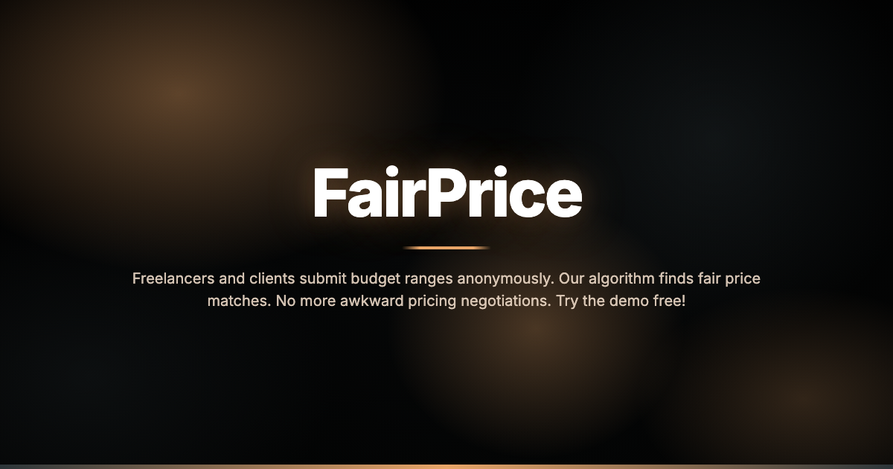
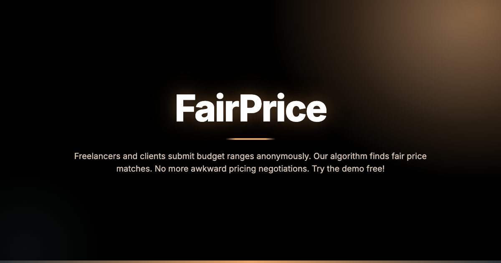
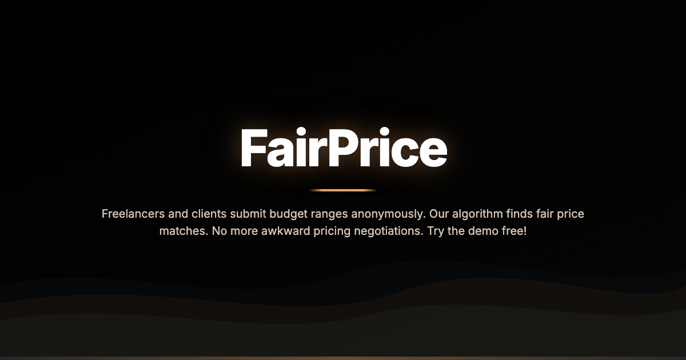
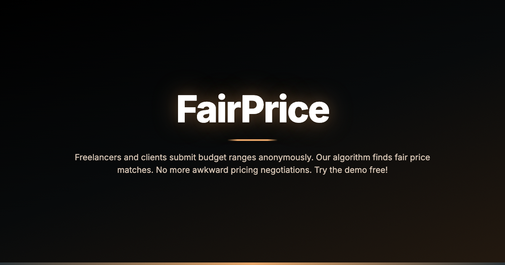
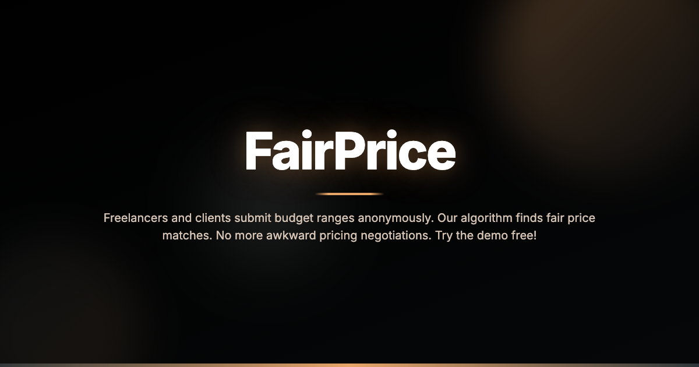
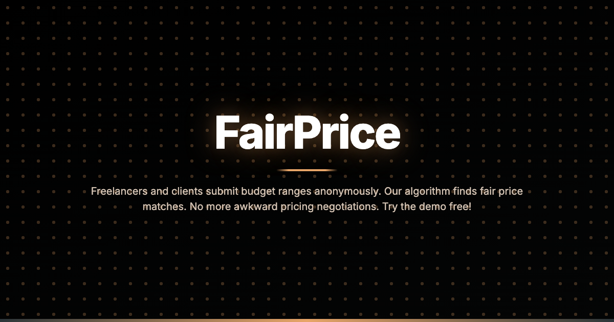
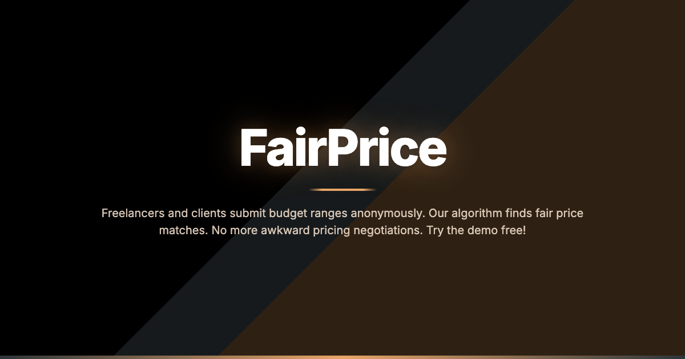
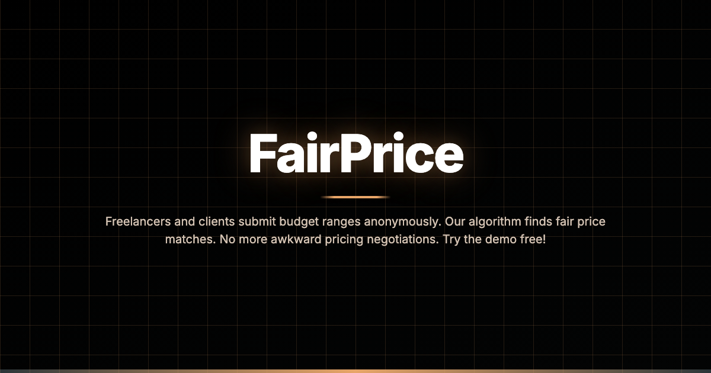

# Brand Kit Generator

Generate a complete favicon set and Open Graph image from any website URL. Extracts brand colors automatically and creates professional assets with 10 customizable background effects.


## Features

- **Auto-extracts brand colors** from CSS variables (`--primary`, `--accent`, etc.)
- **Generates complete favicon set**: 16x16, 32x32, 180x180 (Apple), 192x192, 512x512, ICO
- **Creates OG image** (1200x630) for social media previews
- **10 background effects**: aurora, mesh, spotlight, waves, noise, glass, dots, diagonal, geometric, minimal
- **Web UI** with live preview and instant customization
- **CLI** for automation and scripting
- **100% offline** - no API keys required (uses Playwright for rendering)

## Background Effects

| Effect | Description |
|--------|-------------|
| `aurora` | Smooth radial gradient blobs (default) |
| `mesh` | Multi-point gradient blend |
| `spotlight` | Dramatic corner lighting |
| `waves` | Layered SVG wave curves |
| `noise` | Grainy textured gradient |
| `glass` | Glassmorphism with blur |
| `dots` | Polka dot pattern overlay |
| `diagonal` | Bold diagonal color split |
| `geometric` | Grid line pattern |
| `minimal` | Clean simple gradient |

<details>
<summary>View all 10 effects</summary>

**Aurora** (default)


**Mesh**


**Spotlight**


**Waves**


**Noise**


**Glass**


**Dots**


**Diagonal**


**Geometric**


**Minimal**


</details>

## Installation

```bash
# Clone the repo
git clone https://github.com/MarcinDudekDev/brand-kit-gen.git
cd brand-kit-gen

# Run install script (creates venv, installs deps + Playwright)
./install.sh

# Or manually:
python -m venv .venv
source .venv/bin/activate
pip install -r requirements.txt
playwright install chromium
```

### Quick Test

```bash
./test.sh https://your-site.com
```

## Usage

### CLI

```bash
# Basic usage - extracts colors and generates assets
python brand_kit_gen.py https://example.com

# Specify background effect
python brand_kit_gen.py https://example.com --bg-effect spotlight

# Override colors
python brand_kit_gen.py https://example.com --primary "#2c3539" --accent "#e8a568"

# Customize style
python brand_kit_gen.py https://example.com --bg-effect dots --decoration 1.5 --glow 0.5

# Output to specific directory
python brand_kit_gen.py https://example.com -o ./my-brand-kit
```

### Web UI

```bash
# Start the server
python app.py

# Open http://localhost:8000
```

The web UI provides:
- Live preview as you adjust settings
- Color picker for manual tweaks
- Background effect selector
- One-click ZIP download

## Output Files

```
output/
├── favicon.ico          # Multi-size ICO (16, 32, 48)
├── favicon-16x16.png
├── favicon-32x32.png
├── apple-touch-icon.png # 180x180
├── android-chrome-192x192.png
├── android-chrome-512x512.png
├── og-image.png         # 1200x630 social preview
├── site.webmanifest
└── preview.html         # Local preview page
```

## CLI Options

```
--bg-effect     Background effect (aurora, mesh, spotlight, waves, noise,
                glass, dots, diagonal, geometric, minimal)
--primary       Override primary color (#hex)
--accent        Override accent color (#hex)
--background    Override background color (#hex)
--glow          Text glow intensity (0-2, default: 1.0)
--depth         Shadow depth (0-2, default: 1.0)
--decoration    Background effect intensity (0-2, default: 1.0)
--gradient-angle  Background gradient angle in degrees (default: 160)
--font          Google Font name (default: Inter)
--mood          Style preset (default, minimal, bold, elegant, neon)
-o, --output    Output directory (default: ./output)
-v, --verbose   Show detailed progress
```

## Requirements

- Python 3.8+
- Playwright with Chromium

## How It Works

1. **Color Extraction**: Fetches the target URL and parses CSS for color variables
2. **Brand Detection**: Extracts site name from `og:site_name`, `<title>`, or domain
3. **Image Generation**: Renders HTML/CSS via Playwright for pixel-perfect output
4. **Favicon Building**: Resizes the logo to all required sizes using Pillow

## License

MIT License - see [LICENSE](LICENSE)
